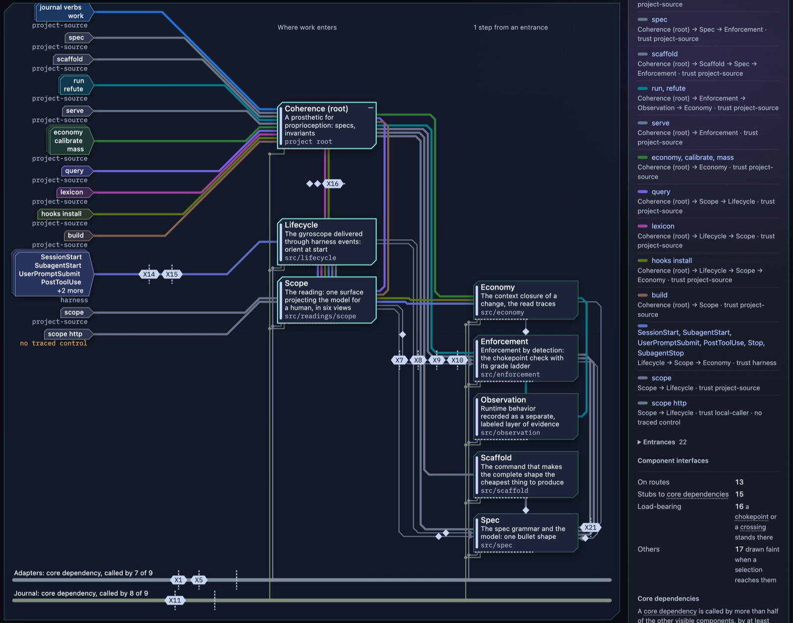
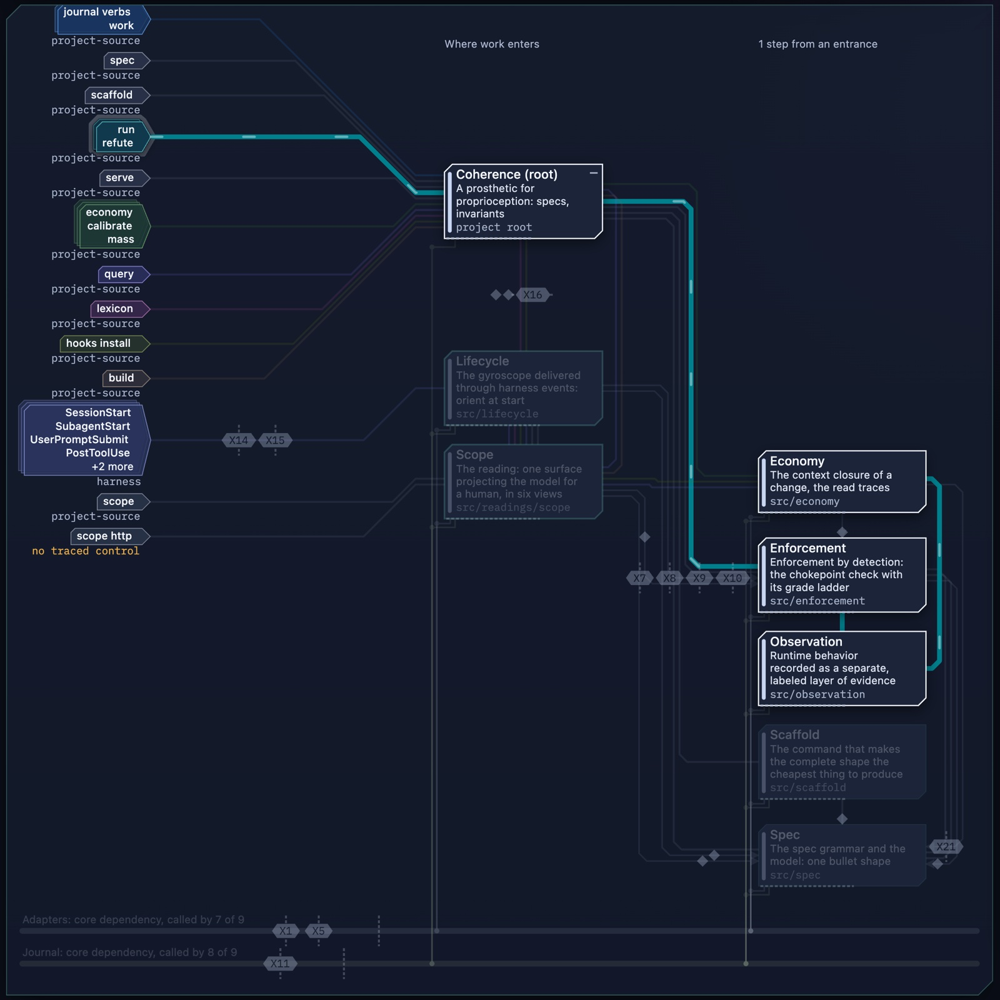
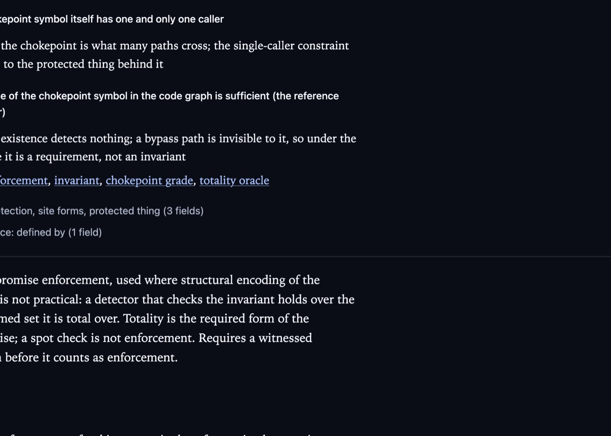
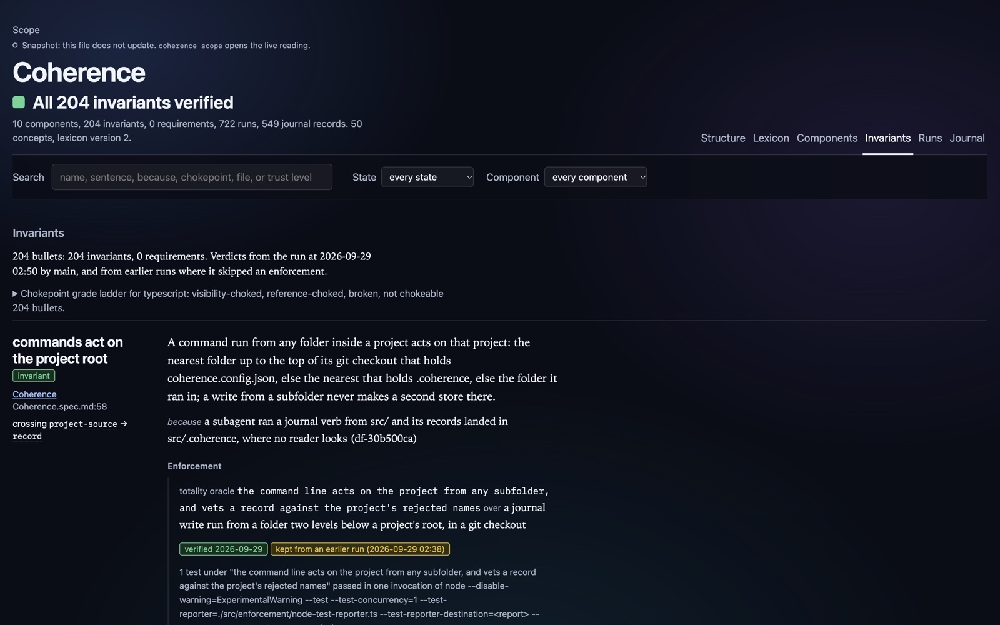
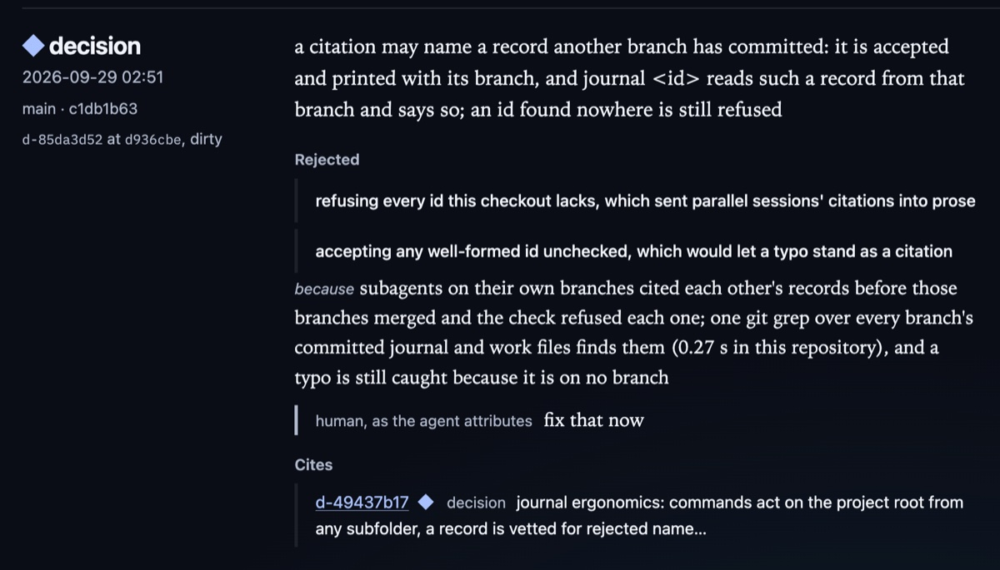

# Coherence

**See what your agents actually built, and know the moment it stops matching
what you meant.**

Agents write code faster than anyone can read it. They are trained to finish
the job, so they cut subtle corners where you can't see them: a read that
skips the session check, a word used in the wrong sense, a decision made
three hundred thousand tokens into a transcript nobody will open again. The
usual answer is more inference: one agent writes the code, another reviews
it, and the findings come back as whack-a-mole.

Coherence takes a different route. It makes your intentions part of the
project's structure, checks them with the same language server your editor
uses, and shows you the result as a live map of the system. Agents get the
right context at the start of every session and hear about a violation in
the same turn they cause it. You get to see the project as it is right now,
without sifting through thousands of lines to find out.

The less inference you spend on code that doesn't work, on finding bugs, and
on reconstructing why a change was made, the more you have left for the
work itself.



## Quick setup: paste this into your agent

```text
Install @posthog/coherence as a dev dependency and run `npx --no coherence hooks install --host claude` (or `--host codex`).
Then run `npx --no coherence query practice "adopt Coherence"`, work through it, record it with `enact`, and tell me what each step found.
```

It needs Node 22.18 or newer on macOS (Apple Silicon) or Linux. The package
is [`@posthog/coherence`](https://www.npmjs.com/package/@posthog/coherence)
on npm, published from this repository with provenance. A checkout kept
beside the project as ../coherence (or named by COHERENCE_HOME) also works,
and the hooks prefer it.

## See the system: the Structure view

`coherence scope` opens Scope, a live page that projects the whole model of
your project for a human. It leads with one verdict (all verified, nothing
enforced yet, or how many invariants are broken), and its first view is
Structure: a transit-style map of what the system is made of and how work
flows through it.

- **Entrances** on the left are where work enters from outside: commands,
  routes, host events, tools. Each carries the trust level of the data or
  caller it lets in.
- **Components** are the folders that carry a spec. They are laid out by how
  far they sit from an entrance.
- **Structural routes** are drawn one color per entrance, following the path
  work takes through the components, in the order it flows.
- **Core dependencies**, the components most others call, run as rails
  along the bottom so they don't tangle the map.
- **Interface identifiers** (X1, X7, …) tag the places where one component
  uses another and a chokepoint or crossing stands there: solid when
  verified, hatched when only a requirement, red when broken.

Every line comes from resolved references the language server reports, not
from a diagram someone drew and forgot to update. When an agent changes how
components relate, the map changes with it.

Select anything to trace it. Selecting an entrance lights its route and dims
the rest, and the side bar lists every interface along the way and how many
reference sites back each one:



When a chokepoint breaks, the component wears a red mark listing every
bypass site, and the map opens on the worst one. An entrance whose untrusted
input reaches the system with no verified chokepoint or totality oracle
traced on its route is flagged `no traced control` (see `scope http` above):
not a demonstrated bypass, but a place to look. Selecting a trust level lights every
crossing that carries it, so you can see where sensitive data goes.

## How it helps

### Agents start with clear definitions

Language models are built out of language, and an ambiguous word produces an
ambiguous implementation. Coherence keeps the project's settled vocabulary in
a **lexicon**: each concept with its definition, its aliases, and the names
rejected for it and why. Your agent's own hooks deliver it at the start of
every session and subagent, so agents do what you meant, not just what you
said. `coherence lexicon --check` finds a rejected name anywhere in prose,
specs, journal records, or identifiers, and `coherence lexicon coverage`
ranks the recurring terms that still lack a definition.

Each concept in Scope's Lexicon view carries its definition, the alternatives
that were rejected and why, and its related concepts. When an agent reaches
for a rejected name, the record of why it was rejected is already there:



### Intentions live in the structure, and the structure is checked

Each component's spec states its **invariants** in one plain bullet grammar,
along with the reason each one matters. An invariant counts only when it has
**enforcement** and a witnessed **refutation**: someone broke it on purpose
and the detector went red.

- A **chokepoint** is the one site every reference to a protected thing must
  pass through, like `sessions.get()` in front of the session store. The
  chokepoint check asks the language server for every reference and flags
  any that go around it. It also stages fake bypasses, without touching your
  files, to prove it would fire; a check that would miss one is reported as vacuous, not
  passing.
- A **totality oracle** is a detector, usually a test, that checks the
  invariant over a whole set, for the cases where a chokepoint isn't
  practical.
- **Crossings** mark the invariants that stand on a security boundary, naming
  the trust levels on either side.



### Violations surface at the edit, not in review

Coherence runs inside your agent host (Claude Code or Codex) through its
hooks. The moment an agent writes a file that may touch a chokepoint, the
check runs again through a warm language server and reports any bypass in
the same turn, by file and line, with the two honest options: route through
the chokepoint, or escalate to a human. At the end of a session, the
regulate step reports what the session still owes; a subagent's stop is
refused only for what the tool can prove.

### Decisions are never buried in a transcript

The **journal** compresses hundreds of thousands of session tokens into a
handful of durable records: decisions with the alternatives rejected and
why, conjectures, defects, experiments, and escalations for a human. Every
record carries its session and agent. If a bad call was made along the way,
it's right there in the history instead of buried in the code, and a later
session can retract it and say what refuted it.

Here is one decision as the Journal view shows it: what was chosen, the
alternatives rejected, the reason, the human words that prompted it, and the
earlier decision it builds on.



### Methods are kept, not rediscovered

Every project has ways of working that live only in someone's head or a
scrollback: how to witness a refutation, how to carry a lexicon change
through, how to merge a parallel worktree without losing records. Each agent
session starts with none of them. A **practice** keeps one: a file beside a
component's spec (`Enforcement.practice.md` beside `Enforcement.spec.md`)
lists the steps, the evidence each step leaves, and the pitfalls, each citing
the record that witnessed it.

```markdown
- witness a refutation: A refutation counts only when the detector went red because of the staged break.
  when: command refute | edit **/*.spec.md adding refuted:
  step: run the bullet's test alone, by its filter, and see it green
    leaves: run record for the bullet, pass
  step: stage the smallest break that changes the behavior the bullet claims
  pitfall: a sed matched two lines, so the test hung and went red only when killed (d-828ddc83)
  learned: d-4dafa61b, df-b9b2711b
  because: the step that slips is the one no command checks: that the red came from the break
```

When a tool use is about to fire a practice's trigger, the hook delivers the
practice whole, before the act. The session records what it did with
`enact`: every step done, deviated, or skipped, with why. Once a practice has
been enacted, a step can only leave it with a decision that says why, so a
method improves through recorded deviations instead of eroding through
silent ones. Coherence ships **kernel practices** for its own commands and
for adoption itself, so an adopter starts with them; each of Coherence's
practices declares `reach: kernel` or `reach: internal`.

### Many agents, one picture

Move between conversations and agents without writing summary files for the
next session. **Work orders** give each unit of work an owner, an objective,
and a file boundary, and journal records and runs bind to them automatically. The **peer feed** drops
the subjects of other sessions' new decisions into each agent before its next
tool use, so subagents compare notes as they go.

### Know what a change will cost

`coherence economy <path>` predicts what a reader must load to change
something safely, with a token estimate. `coherence calibrate` checks that
prediction against what sessions actually read, and `coherence mass` reports
how much code no invariant's enforcement reaches yet.

## Full setup: paste this into your agent

It needs Node 22.18 or newer on macOS (Apple Silicon) or Linux.

```text
Set up Coherence in this project, and report what each step found.

1. Install. Run `npm install -D @posthog/coherence` (or `pnpm add -D
   @posthog/coherence`). Do not `npm link` a checkout into the project. The
   command is `npx --no coherence` (call it `coherence` below); `--no` keeps
   npx from fetching an unrelated package if the install is missing.
   Teammates get it from the lockfile.

2. Hooks. Run `coherence hooks install --host claude` (or `--host codex`).
   From the next session on, every session starts with Coherence's
   vocabulary, the project's standing, and the exact journal commands.

3. Adopt. Run `coherence query practice "adopt Coherence"` and work through
   it: config, vocabulary, specs and entrances, the invariants that matter
   most, refutations, baselines, and the methods the project already has.
   Each step names the practice or command that carries it; a practice is
   delivered whole when its command is about to run. When done, record it:
   `coherence enact "adopt Coherence" --step <n>=done|deviated:<why>|skipped:<why> ...`.

Record every non-obvious choice with `coherence decide "<chose>" --over
"<rejected>" --because "<why>" --session <id> --agent <name>`.
```

Adoption is a practice rather than prose so that its steps arrive where
their commands run, its pitfalls cite what went wrong in earlier adoptions,
and the enactment is a durable record of how the project was adopted
(`coherence query practice` lists every practice).

The installed hooks look for Coherence at `$COHERENCE_HOME`, then
`../coherence` (also beside the main checkout of a git worktree), then the
installed package; where none is found, the session start says so in one line.
To add the project's own words to an event, write
`.coherence/hooks/<Event>.append.md` (it follows what the hook says) or
`.coherence/hooks/<Event>.override.md` (it replaces it; an empty one silences
the event). `{{session}}`, `{{agent}}` and `{{cli}}` are filled in; a refused
subagent stop keeps its reason whatever the override says.

## Platform

Coherence runs on Node 22.18 or newer, on macOS (Apple Silicon) or Linux, and
reads TypeScript and Python projects. It works inside Claude Code and Codex.
Coherence verifies itself: every screenshot here is its own Scope reading.

## Working on Coherence itself

From this checkout, the same commands run as `node src/cli.ts <command>`:

```sh
node src/cli.ts journal                   # merged project history across every session
node src/cli.ts journal --subjects        # subjects and a cursor; --since <cursorOrIso> reads what followed
node src/cli.ts lexicon                  # the compact form the hook injects; token estimate on stderr
node src/cli.ts lexicon --check [paths]  # rejected names and unknown nouns; exit 1 with findings
node src/cli.ts spec --check [root]       # components, invariants with state, problems; exit 1 on problems
node src/cli.ts spec --json [root]        # the spec model
node src/cli.ts scaffold component <folder> "<intent>"
node src/cli.ts scaffold invariant <folder> "<sentence>" --kinds a,b [--chokepoint|--totality-oracle] [--write]
node src/cli.ts enact "<practice>" --step <n>=done[:<evidence>]|deviated:<why>|skipped:<why>...   # record a practice carried out
node src/cli.ts run [--session --agent]   # the chokepoint check and the totality oracle pass, one run appended; exit 1 on a structural defect
node src/cli.ts run --status              # the latest verdict per enforcement, a view over every run
node src/cli.ts serve                     # the warm language server for this project (spawned on demand otherwise)
node src/cli.ts hook <event>              # answer one harness event (event JSON on stdin)
node src/cli.ts hooks install --host claude|codex [--command "<prefix>"]
node src/cli.ts hooks uninstall --host claude|codex   # removes only Coherence's commands; other hooks and settings stay byte for byte
node src/cli.ts hooks --check --host claude|codex     # exit 1 naming each event missing, stale, or extra against what install would write
node src/cli.ts hooks status                          # the wiring per agent host, and what each event delivers for this project
npm run spec:check                        # the spec check alone
npm test                                  # typecheck, tests, vocabulary check, spec check; any one failing fails the tree
```

A project names its own lexicon under `lexicon` in `coherence.config.json`
(default: `lexicon.json` at the root). A project still carrying the file under
the concept's retired name is refused with the one-line `git mv` that migrates
it; the old name is never read. SessionStart and SubagentStart inject
both layers with a short instruction, the journal read command, and a decision
write template. This checkout carries hooks for both Claude Code and Codex;
`node src/cli.ts hooks status` reports their installation and what each event
carries here (orient at the starts, the peer feed at prompt and tool boundaries,
a practice before a tool use that fires it, regulate at the stops), and `hooks --check` is the CI form. Stop reports the check
over changed files; SubagentStop refuses the stop (exit 2, reason on stderr) while findings remain.

## Lexicon workflow

Coverage, preview/apply maintenance, sense review, drafting, incremental checks,
and optional local similarity are described in [Lexicon operations](docs/lexicon-operations.md).
Run `node src/cli.ts lexicon help` for the command surface. Coverage counts
observations and unresolved questions; it is not a semantic-completeness score.

## Test setup

Use Node 22.18 or newer and Python 3.10 or newer. From the checkout root:

```sh
npm ci
npm run test:setup
npm test
```

`test:setup` creates `.venv` and installs the pinned pytest version from
`requirements-test.txt`; it does not change the system Python. Run it again
when that file changes. The environment is ignored by git. Tests themselves
never install dependencies or need a network connection.

`npm test` includes the real pytest integration, not just its report reader.
A missing interpreter or pytest is a failure with setup instructions, not a
skip. `npm run test:python` runs the Python adapter tests alone.

The tests find `.venv/bin/python` relative to this checkout, even when their
working directory differs. Set `COHERENCE_PYTHON` to use another interpreter
with pytest; an invalid override fails instead of falling back silently.
During `test:setup`, the same variable selects the Python that creates `.venv`.

## Releasing

The package is `@posthog/coherence` on npm. `npm run build` compiles `src`
into `dist` (Node will not strip types under node_modules) and carries the
files the compiled modules read: data, the stylesheet, the Scope browser
sources already stripped, and the one font file with its license. The build
runs as `prepare`, so `npm ci`, `npm pack` and an install from the git
repository all build. `node-llama-cpp` is an optional peer: a project that
wants the local embedding pass installs it beside Coherence.

To release, merge a change that bumps `version` in package.json into main.
The Release workflow sees a version npm does not have, publishes it through
npm trusted publishing from `.github/workflows/release.yml` in the `Release`
environment, with provenance and no stored token, and tags it as a GitHub
release with generated notes. Any other change to package.json releases
nothing. The workflow can also be run by hand from the Actions tab.

## Further reading

- `Coherence.spec.md` and the `*.spec.md` file in each folder under `src/`: Coherence's own trust levels and invariants, in its own grammar.
- `docs/lexicon.json`: the settled vocabulary; `docs/lexicon.md`: why the lexicon is first-class, with the evidence.
- `docs/spec.md`, `docs/enforcement.md`, `docs/journal.md`, `docs/economy.md`, `docs/observation.md`, `docs/scope-shell.md`: how each part works.
- `docs/checklist-seed.json`: the invariant shapes behind the decomposition checklist.
- `docs/retired.md`: mechanisms retired during the rebuild, with reasons.
- `docs/reference/data-is-destiny.md`: "Data is destiny" (Danilo Campos, CC BY-SA 4.0), the essay behind Scope.
