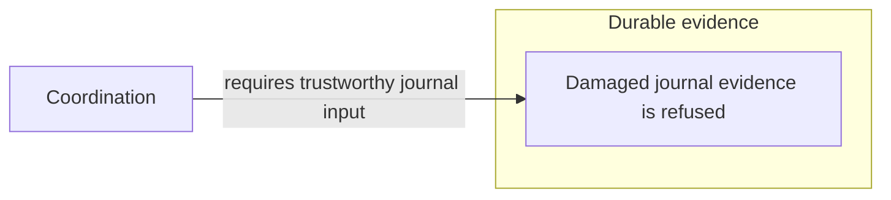

# Scope Structure: implementation thesis

Written 2026-09-11 from the Structure design discussion and the current working tree.

**Status:** the product direction below is agreed; explicitly marked proposals are
implementation recommendations to test. This is a design and implementation thesis,
not a claim that the described experience is already implemented. The current
configuration syntax and capabilities are documented in `docs/scope.md` on the local
implementation branch.

**Publication scope:** only this thesis is being published to `main`. The unfinished
declarative Scope replacement is retained locally on `wip/scope-declarative`; it is
not a released replacement for the existing Scope. Descriptions of the current
foundation below refer to that local implementation. Its source paths are given as
code references because those files are not all available on `main` yet.

Reading guide:

- [Agreed requirements](#2-agreed-requirements) and [current implementation](#4-the-current-foundation-and-its-limits).
- [Spec authorship](#6-specs-own-entrances-and-architectural-relationships) and [opening composition](#7-opening-composition-and-spec-density).
- [Stacks and zoom](#8-stack-expansion-and-semantic-zoom), [cards](#9-card-design), and [connections](#10-meaningful-connections-and-guarantees).
- [Taxonomy](#11-taxonomy-in-structure), [uncertainty](#12-uncertainty-and-sensitivity), and [sidebar](#13-selection-sidebar).
- [Comparison](#14-current-state-and-explicit-comparison), [extensibility](#15-declarative-views-and-replaceable-renderers), and [MCP](#16-agent-control-through-mcp).
- [Real-project experiment](#18-real-project-design-experiment), [implementation sequence](#19-implementation-sequence-and-deliverables), [acceptance](#20-acceptance-criteria), and [open decisions](#21-decisions-still-requiring-evidence).

## 1. Thesis

Structure is the first default Scope tab. It explains what a project is, where a
reader enters it, how its major responsibilities fit together, and what promises
make those relationships meaningful. It also explains architectural change when a
comparison is deliberately opened.

The main visual unit is a **component stack**. Closed stacks give the project an
understandable outline. Opening a stack unfurls architectural cards and their local
relationships inside a recognizable component region. Connections between stacks
persist and disclose their supported endpoints as either side opens. The reader can
investigate a part while retaining its place in the larger project.

Zoom and expansion are independent. Zoom changes the detail presented on visible
cards and connections. Expansion changes which architectural assets are exposed.
Small tiles at a distance become detailed cards nearby. Neither operation invents
new architectural facts.

Scope ships a strong default using the same declarative capabilities available to
projects. Projects can replace configured views and supply new renderers. Canonical
readers and project specs own meaning; shared projections select and join it;
renderers make it understandable.

## 2. Agreed requirements

These requirements incorporate the final design corrections and take precedence
over earlier suggestions from the discussion.

| Area | Requirement |
| --- | --- |
| Opening | Structure is the first default tab and opens on current project state. |
| Prominence | Spec density is a useful discriminator for major components. The exact metric remains to be designed. |
| Main form | Components appear as connected stacks that unfold into local architectural relationships. |
| Disclosure | Expansion stays within the larger picture; variable zoom supplies small tiles through detailed cards. |
| Architectural scale | The default Structure does not reveal file cards or become a source browser. Source addresses can lead to the IDE. |
| Relationships | Bare import arrows do not belong on the default map. Visible connections must explain architectural meaning. |
| Authorship | Specs own architectural declarations and relationships. Examine whether the root spec needs richer project-level declarations. |
| Guarantees | Show ownership, enforcement and explicit consumers without inventing guarantee consumption from imports. |
| Taxonomy | Make assessed roles and facets useful for orientation and obligations while retaining their evidence limits. |
| Comparison | Comparing two compatible asset snapshots is foundational, even though comparison is off by default. |
| Removed elements | Retain removed assets as ghosted cards and former connections as dashed lines. |
| Agent control | An MCP surface must let an agent open and direct Scope, including comparisons for the user. |
| Evidence | Distinguish uncertainty from observed failure, with attention informed by the significance of the affected fact. |
| Detail | A sidebar explains the selected card or connection. |
| Validation | Stress-test the design on a real project. Coherence is the proposed first project. |
| Extensibility | Both configured views and their renderers must be extensible or replaceable. |
| Libraries | Continue using React, Radix, React Flow and Cytoscape, with the existing bundling foundation. |

The previous Scope is a source of lessons and useful regression cases. Reproducing
its full feature set is not the acceptance criterion for this new default. The
earlier generic rebuild broadened asset access but did not preserve all old
workflows; passing its tests does not establish the design in this document.

## 3. The questions Structure must answer

A reader should be able to answer these questions through progressive exploration:

1. What does this project do, and where should I start?
2. What are its major responsibilities, and which component owns each one?
3. What crosses a boundary, what changes meaning there, and why does the boundary exist?
4. What does a component promise, where is that promise enforced, and who relies on it?
5. What roles have been assessed here, and what obligations do those roles suggest?
6. What evidence supports the selected promise, and what remains uncertain?
7. When a comparison is open, what changed and which declared assumptions deserve review?

The map provides orientation and relationships. The sidebar supplies exact wording,
rationale, evidence and provenance. An IDE supplies source-level exploration.

The opening should remain useful when a project has few declarations. Sparse
semantics should produce an honest sparse explanation and discoverable gaps. Dense
semantics should unfold without forcing every declaration onto the opening canvas.

## 4. The current foundation and its limits

The working implementation provides an asset catalog, canonical-reader adapters,
data-only configuration, generic graph/table/card renderers, an attribute inspector,
offline HTML, and a live loopback server. These are useful foundations.

| Existing surface | Reuse and required extension |
| --- | --- |
| `src/readings/scope/catalog.ts` | Assets, relations, source availability and attribute inventory. Extend the contracts deliberately for stable comparison and shared semantic projections. |
| `src/readings/scope/capture.ts` | Canonical readers, spec content, evidence attribution and source transactions. Audit semantic relationship resolution and comparison identity. |
| `src/readings/scope/configuration.ts` | Default view replacement, selection, sorting, grouping and basic layout options. Add declarative stacks, detail levels, joins, connection presentation and renderer validation. |
| `src/readings/scope/app.jsx` | Shared viewer, basic navigation, live snapshots and generic inspection. Introduce stack interaction, a renderer contract and the architectural sidebar. |
| `src/readings/scope/layout.mjs` | Cytoscape layout and rectangular clearance. Extend or replace this projection for nested variable regions, stable endpoints and comparison layout. |
| `src/readings/scope/server.ts` | Read-only loopback delivery and serialized captures. Add explicit integration with a separate viewer-control capability; the current HTTP surface accepts GET only. |
| `src/readings/render-scope.ts`, `scripts/build-scope.mjs` | Shared offline/live bundle. Preserve standalone viewing and support deliberate build-time renderer registration. |
| [scope-model.ts](../src/readings/scope-model.ts) | Existing ownership, guarantee, crossing and evidence semantics. Preserve canonical meanings while choosing the new presentation independently of legacy gravity geometry. |

The current renderer field is a closed choice of `graph`, `table`, or `cards`.
There is no implemented custom-renderer registry, stack projection, semantic zoom
contract, two-snapshot comparison, or Scope MCP control surface in this foundation.
The proposed configuration and operations below are not accepted APIs yet.

The catalog currently declares 50 asset kinds. Full catalog access remains useful
for other views; Structure intentionally presents only an architectural selection.
New canonical families must be adapted at the shared reader seam rather than
interpreted privately by the Structure renderer.

## 5. Canonical material for the story

| Material | Contribution to Structure |
| --- | --- |
| Project and component identity, intent, prose | Project introduction, stack identity and responsibility. |
| Spec containment | Component enclosure and nested stacks. It does not establish a dependency. |
| Invariants, claims and guarantees | Exact promises, declared enforcement and recorded readings. Unanchored declarations remain visible. |
| Spec-owned guarantee links and bindings | Explicit consumers, addressed obligations, local parameters and named endpoints. |
| Atlas charts and transitions | Authored domains, `from`, `to`, `translates`, owning component, boundary symbol and associated guarantees. |
| Zones | Declared trust topology, preserving the canonical rules for which spec has topology authority. Zones and atlas charts are different concepts. |
| Rationale and refutations | Why a boundary exists and the recorded failure that motivated a promise. |
| Taxonomy assessments and vocabulary | Selected roles/facets, candidates, evidence currency and suggested obligations. |
| Resources and platform bindings | Declared infrastructure or runtime capabilities and their explicit relationships. |
| Claim results and receipts | Recorded evidence, with its revision, scope and evidence grade. |
| Explicit consequence records | Assessed relationships to outcomes, when those edges actually name the relevant subjects. |
| Files and symbols | Ownership resolution, enforcement addresses, evidence identity and IDE links. These are not default source cards. |
| Source availability | Whether the population and evidence behind a displayed explanation could be read. |

Imported adjacency may help an author investigate a missing explanation. It does
not automatically establish runtime order, a data flow, a guarantee dependency or
causality. No renderer may promote it into one of those meanings.

## 6. Specs own entrances and architectural relationships

Start by measuring what the current project declares. Inventory entrances,
component responsibilities, transitions, guarantee consumers and missing endpoints
before adding grammar. Count resolved, unresolved and absent declarations separately.

The configured `entryDir` is an entry component, not necessarily an execution
entrypoint. In the examined Coherence configuration it is `.`. A root repository
spec can also describe the repository's reading surface rather than the project's
entire product purpose. Neither fact should be silently converted into an invented
runtime entrance or project introduction.

**Proposed semantic additions, if the inventory demonstrates the need:**

- A stable project-level introduction with references to the existing authored explanation.
- Named entrances with owner, role, architectural purpose and an optional source anchor.
- An explicit consumer relationship naming the consuming component, provider guarantee,
  the reason it is needed, and optional consuming boundary.
- Additional boundary transformation declarations where existing atlas or spec grammar
  cannot carry the required meaning.
- Explicit significance declarations where canonical evidence cannot explain the cost
  of uncertainty at a particular boundary or promise.

Prefer extending existing canonical grammar and identities over creating parallel
spellings for relationships already expressible through guarantee links or atlas
declarations. Root specs can explain cross-component architecture while local specs
own local promises. The exact section names, identity syntax and ownership rules are
pending the inventory and parser design.

Scope configuration controls selection, emphasis, wording of presentation labels,
and layout. It does not create private architectural assertions that other Coherence
readers cannot see. Authored descriptions remain attributable; a label chosen for a
view cannot change the underlying relationship's meaning or evidence grade.

Validate missing and ambiguous owners and endpoints at the canonical seam. Keep
unresolved declarations inspectable without drawing confident connections to guessed
subjects. A meaningful relationship needs a named object: “requires validated
configuration” conveys more than “depends on.”

## 7. Opening composition and spec density

The opening consists of a project introduction, named entrances when declared, and
a legible arrangement of major component stacks with meaningful connections.
Declared containment determines ownership. It need not force the reader through an
otherwise empty root wrapper before seeing the major responsibilities.

Spec density guides which components receive initial emphasis and detail. It is a
presentation discriminator, not a correctness score. A plausible metric uses distinct
responsibilities, invariants, boundary declarations, semantic relationships and
supporting explanation. Exact weighting, normalization and thresholds are open.

Requirements for the metric:

- Attribute each declaration to its canonical owner before aggregating.
- Distinguish a component's own declarations from a summarized subtree.
- Avoid counting the same promise once as an invariant, again as an anchor claim,
  and again as a guarantee projection without disclosing that duplication.
- Keep anchored and unanchored promises distinguishable; evidence availability does
  not determine whether a responsibility deserves to be seen.
- Do not let repeated wording or prose length alone dominate prominence.
- Show the inputs to the score in inspection and allow configuration to adjust emphasis.
- Keep low-density components reachable; missing specification is not irrelevance.
- Preserve declared entrances even when their own specification is small.

Opening density must be tested at actual screen sizes. Card area primarily serves
readability. Code mass does not automatically set a stack's size. Any visual omission
or bounded population needs a visible way to discover the rest.

## 8. Stack expansion and semantic zoom

### 8.1 Expansion state

| State | Visible structure |
| --- | --- |
| Closed stack | Component identity, zoom-appropriate summary, visible stack cue and external architectural relationships. |
| Open stack | A titled component region containing its selected child components, guarantees, entrances/boundaries and resources, connected locally. |
| Nested stack open | A child component unfolds within the ownership hierarchy while ancestor context remains recognizable. |
| Focused selection | One card or relationship is emphasized and explained in the sidebar; the surrounding map remains available. |

Opening reveals relationships rather than simply extending a text box. The default
expansion does not reveal a file tree or a call graph. Symbol names can identify a
boundary card or appear as an enforcement address without becoming a general source
exploration level.

**Proposed interaction:** the card has a clear unfold affordance; selection opens
the sidebar. The exact click target and keyboard mapping must avoid accidental
expansion when selecting a promise or following a relationship. Multiple stacks
should remain open for comparison, subject to explicit and visible density controls.

### 8.2 Detail levels

| Zoom | Closed stack | Open stack and connections |
| --- | --- | --- |
| Far | Small named tile, stack cue, important entrance/change/uncertainty marker. | Compact architectural tiles, principal connections and intelligible bundle markers. |
| Medium | Purpose, selected promises, compact taxa and change summary. | Local responsibilities and meaningful relationship labels. |
| Near | Detailed component card with selected guarantees and supporting readings. | Detailed guarantee/boundary/resource cards and individually inspectable connections. |

Zoom must preserve expansion, selection and the logical position of existing assets.
Detail changes should use stable logical bounds where practical. Thresholds require
hysteresis or an equivalent treatment to prevent flickering during small zoom changes.
They must remain configurable rather than embedded as special cases in cards.

At far zoom, text needs screen-readable treatment or replacement by a simpler tile;
merely shrinking a paragraph does not provide semantic zoom. Reveal full authored
wording through near detail or the sidebar. Never silently replace it with an
unattributed interpretation.

### 8.3 Geometry and continuity

Expansion may require nearby stacks to yield space. Stable camera position does not
require all surrounding positions to remain mathematically fixed during expansion.
Test a short, understandable transition that preserves the selected component's
anchor, ownership boundaries, and external connection continuity.

By contrast, panning, zoom detail changes and evidence-only updates should not rerun
the architectural arrangement. Closing a stack should restore a predictable compact
composition. Opening a sidebar should not trigger an unsolicited fit or lose focus.

Cytoscape remains the layout foundation; React Flow owns canvas interaction and
connection rendering. The precise nested layout, region growth policy, routing and
packing rules need the real-project prototype. Do not promise arbitrary obstacle-free
routing or unlimited expansion before measuring them.

## 9. Card design

Card variant, zoom detail and change state are independent dimensions. Shared anatomy
keeps cards recognizable while their main content answers different questions.

### 9.1 Common anatomy

1. **Identity:** name, architectural kind and explicit entrance designation where relevant.
2. **Meaning:** the purpose, exact promise or transformation that earns the card its place.
3. **Substance:** a small amount of variant-specific architectural content.
4. **Connections:** meaningful attachment points, with selection and provenance available.
5. **State:** relevant uncertainty or evidence, plus comparison changes when enabled.

Stack edges suggest discoverable contents. Explicit counts explain the population;
pile thickness must not masquerade as a precise measure. Supporting source addresses
belong in inspection, not in place of a useful architectural title.

### 9.2 Default variants

| Variant | Main question | Close detail |
| --- | --- | --- |
| Component stack | What responsibility lives here? | Purpose, selected promises, immediate architectural contents and interfaces. |
| Guarantee | What must hold? | Exact promise, owner, enforcement anchor, named oracle, recorded evidence and freshness. |
| Entrance or boundary | Where does interaction begin or meaning change? | Declared role or domains, transformation, responsible owner/anchor and associated guarantees. |
| Resource | What capability is used or retained? | Declared type and binding, with explicit architectural relationships. |

Entrances and transformations can share a visual family but must have distinct
labels. General file and symbol cards are excluded from default Structure. Their
underlying assets remain available to source links, joins and other configurable views.

Taxon or obligation cards can be considered for a focused investigation where they
are the subject of interest; they are not mandatory additional peers in the opening map.

### 9.3 Component example

This illustrative face uses the actual responsibility and promises of Source adapters;
the change summary is hypothetical and appears only in comparison mode.

```text
Source adapters                                      MODIFIED
COMPONENT

Translate language syntax and platform configuration
into the common graph vocabulary.

PROMISES
A grammar-backed adapter derives the graph through
the same language seam.
A parse's heap is returned before the next file.
                                             + more promises

CHANGES
1 guarantee edited · implementation changed

                                      Unfurl component ↗
```

The promise that a declared language resolves to a real adapter or refuses belongs
to Source derivation, not Source adapters. Preserve the spec's ownership when composing
cards, even when neighboring responsibilities make an alternative placement tempting.

Choose displayed promises through an explicit rule: configured emphasis, the selected
relationship, or the active change investigation. Name withheld promises and expose
the complete set. Final default limits are a readability experiment, not a fixed rule
established by this document.

### 9.4 Guarantee evidence

The guarantee's text comes first. Enforcement, named oracle and recorded result are
separate readings. Naming a test does not prove it ran; a receipt does not automatically
establish that it assessed this promise; a passing claim does not grade its owner green.

Show unanchored declarations, missing evidence, stale evidence and recorded failure
distinctly. Rationale and refutations explain why the guarantee exists. Detailed history
belongs in the sidebar so cards remain readable.

## 10. Meaningful connections and guarantees

### 10.1 What earns an arrow

A visible architectural connection must explain a declared relationship, such as:

- what becomes what at an authored boundary;
- which named promise a consumer requires and why;
- which boundary enforces a selected promise;
- which declared resource participates in an explicitly described relationship.

Bare `imports`, `uses`, or object-free `depends on` arrows do not qualify. Imports
remain supporting source evidence. A sparse semantic map is preferable to filling
gaps with adjacency dressed as architectural meaning.

Containment is primarily expressed by enclosure. Taxonomic similarity is primarily
expressed by annotations and highlighting. Evidence and rationale connections can
appear in focused exploration without permanently adding every supporting edge to
the project-wide map.

### 10.2 Owner, enforcement and consumer

A guarantee has one canonical owner and can have multiple explicitly declared
consumers. Enforcement can be named at a boundary or symbol. Those roles must not
collapse into one generic component dependency.

The following is an illustrative relationship, not an assertion that this exact
consumer declaration already exists in Coherence:



At the collapsed level, a connection can attach to a named promise on the provider's
stack face. With the provider open, it resolves to that guarantee card. With the
consumer open, it resolves to its declared consuming boundary if one is named;
otherwise it stays attached to the consumer component.

An internal guarantee need not acquire an external line. Its absence of declared
consumers says nothing by itself about the guarantee's importance or quality.

### 10.3 Expansion of connections

| Expansion | Endpoint presentation |
| --- | --- |
| Both stacks closed | Component-level presentation with the relevant promise or transformation named. |
| Provider open | Provider endpoint resolves to the supported internal guarantee or boundary; the consumer can remain aggregated. |
| Consumer open | Consumer endpoint resolves to a named consuming boundary when declared; provider can remain aggregated. |
| Both open | Both endpoints resolve to their supported architectural detail. |
| Collapsed again | The same underlying relationships gather into their component-level presentation. |

Stable relationship identity persists across all these presentations. A bundle is
a view over identifiable members, not a new claim. Preserve semantic direction and
separate kinds; a dependency arrow points from consumer toward the required promise,
whereas a transformation follows its declared `from` and `to` domains.

Selecting a bundle lists and highlights its members. Selecting a single connection
explains the declaration, endpoints and source in the sidebar. Focus should have a
keyboard-accessible equivalent and should not require hover.

When precise endpoints are unsupported, leave the attachment at the component
boundary and explain the limit. Opening a stack must never invent a runtime call
path or silently route a line through an unrelated guarantee.

## 11. Taxonomy in Structure

Taxa provide architectural vocabulary. They explain assessed responsibilities,
support discovery across ownership boundaries, and give context to suggested obligations.

On an assessed subject, display selected roles/facets with their current assessment
state. On a component stack, summarize exact owned assessment subjects with counts,
for example “Persistence · 4 subjects” if such a role is actually selected. That is
an aggregate over subjects, not a new assessment of the component as a whole.

Canonical ownership governs aggregation. Do not silently count a nested component's
subjects as its parent's own selections. Keep selected roles, candidates, ambiguity,
no-fit, stale assessments, unassessed subjects and unavailable taxonomy distinct.

Selecting a taxon highlights its assessed subjects and containing stacks. Sharing
a taxon does not create a dependency arrow. A role spanning several components can
be explored without changing the ownership hierarchy.

When an assessed subject has no architectural card, highlight its owning stack and
identify the subject in the sidebar. Taxonomy exploration must not introduce file
cards merely to display every assessment target.

The obligation investigation is a sequence of different evidence grades:

```text
Assessed taxon
  → suggests an obligation
  → an explicit mapping identifies a local guarantee
  → the guarantee names enforcement and recorded evidence
```

A suggestion is not an activated or satisfied promise. An explicit mapping is not
proof of correctness. Explain these steps in the sidebar or focused local cards.
Taxonomy labels must not promote candidate classifications into selected roles.

Comparison should distinguish an assessment revision, expiration caused by changed
evidence, and a changed guarantee mapping. Staleness alone does not establish that
the component's responsibility changed.

The parallel obligations and review design (`docs/code-contracts-lessons-design.md`) is
proposed canonical work, not an already implemented source of new Scope semantics.
If authored spec obligations are introduced, adapt them through their canonical
reader and keep them distinguishable from taxonomy-suggested obligations and enforced
invariants. Reconcile vocabulary when that implementation exists.

## 12. Uncertainty and sensitivity

Attention should depend on the uncertain fact and its architectural significance.
A missing paragraph and stale enforcement evidence at an explicitly sensitive
crossing should not receive identical visual weight.

Keep three independent dimensions:

| Dimension | Question |
| --- | --- |
| Significance | What declared responsibility, boundary or consumer depends on this fact? |
| Uncertainty | What is missing, ambiguous, stale or unavailable? |
| Observed failure | What evidence actually reports a failure, with what scope and provenance? |

**Proposed explainable inputs:** explicit security-sensitive transitions, named
guarantee consumers, applicable assessed roles/obligations, and explicitly linked
refutations or consequences. Expose the reason for attention rather than inventing
a whole-component safety score.

For example, “Evidence is stale for a guarantee with declared consumers” explains
the concern and gives the sidebar something concrete to unpack. Direct declared
consumers are observable context; transitive impact and actual breakage are stronger
claims that require additional evidence.

At the design checkpoint, the local configuration contained 62 atlas transitions,
48 marked `security: true`. Reproduce this observation with:

```sh
node -e 'const c=require("./coherence.config.json");const t=Object.values(c.atlas?.transitions??{});console.log({transitions:t.length,securityMarked:t.filter(x=>x.security===true).length})'
```

That population supports a real experiment and also shows why a binary sensitive
component badge would provide little prioritization in Coherence. These are local
declaration counts, not measured security risk or permanent project constants.

Missing significance declarations produce unknown significance, not low sensitivity.
Stale taxonomy cannot silently become a current risk classification. A historical
refutation explains a prior failure without establishing an ongoing defect.

Uncertainty should remain discoverable at every zoom level, with prominent treatment
where a displayed conclusion depends on the unavailable fact. Source unavailability
must remain visible even if selection, filters or low-priority styling hide individual
assets. Exact visual thresholds and any new spec syntax require prototype evidence.

## 13. Selection sidebar

Use one sidebar for a selected card, guarantee, taxon, connection or bundle. Maintain
the map's selection, expansion and camera when it opens, updates or closes.

**Proposed content order:**

1. Identity and purpose, exact promise, or relationship meaning.
2. Ownership, participants and explicit consumers.
3. Relevant guarantees, taxonomy and evidence readings.
4. Rationale and refutations.
5. Source references and IDE navigation.
6. Before/after detail when comparison is active.

The order can be adapted by variant and active task. A change-focused selection may
put before/after directly below identity. Full raw attributes can remain accessible
as a secondary inspection surface rather than being the main human explanation.

Follow links in the sidebar without losing a route back to the original selection.
Expose excluded populations and unresolved relationships. The source address of an
enforcement symbol should open the IDE at that location where supported; the exact
editor integration and fallback are pending platform design.

Long prose, exact spec edits and evidence histories belong here. General source-file
diff browsing belongs in the IDE. Structure can report an implementation change and
link to it without promoting source files into architectural cards.

## 14. Current state and explicit comparison

### 14.1 Ordinary mode

Opening Structure shows the current project without a baseline or unsolicited diff
markers. The viewer identifies snapshot currency and live/paused state. Current
uncommitted source state is not itself a request to open a comparison.

An agent can explicitly open a comparison through MCP. A human must be able to see
which comparison is active, inspect its endpoints and return to current state.
Human-accessible comparison controls are compatible with this requirement; their
exact placement is pending design.

### 14.2 Comparison inputs

Comparison requires two compatible canonical asset snapshots with retained provenance.
Potential inputs include saved snapshots, committed revisions and a captured working
tree. Git can identify repository states; it does not by itself supply comparable
Coherence semantics.

Each side should retain capture identity, project identity, revision when available,
material working-state identity, capture time, schema/reader compatibility, configuration
context and independent source availability. A dirty bit alone cannot distinguish two
different working trees at the same commit.

Historical derivation must have a documented reader/configuration policy and must
not disturb the user's active checkout. Do not silently load current status or current
assessments into the historical side. A revision without retained evidence has missing
historical evidence. Capturing or displaying a comparison does not run verification.

**Proposed initial policy:** pin both captures when a comparison opens. Updating a
live working-tree side is an explicit, visible operation. The exact live-refresh
policy remains open; the before side must not drift unnoticed.

### 14.3 Identity and matching

Separate stable semantic identity from revision content and evidence observation.
The current capture uses content-derived keys for several assets and relations, and
[guaranteeRef](../src/verification/boundary.ts) derives canonical guarantee addresses
from owner and parsed boundary content. A wording edit may therefore change an address.

Audit each displayed family before promising modification matching. Prefer explicit
canonical identity where available. Keep revision addresses intact for evidence;
introduce correspondence in the comparison layer rather than rewriting historical
records to manufacture stability. If new authored stable IDs are necessary, design
them at the canonical spec seam with migration and validation.

Moves, renames and ambiguous matches need an explicit policy. Do not merge unrelated
assets because their labels look alike. When correspondence cannot be established,
report additions/removals and the uncertainty. Never hide ambiguous matching behind
a confident “modified” card.

### 14.4 What changes mean

| Reading | Meaning |
| --- | --- |
| Added or removed asset | The asset exists on only one available, comparable side. |
| Modified declaration | Comparable purpose, promise, mapping or architectural meaning differs. |
| Implementation changed | Underlying source changed for an owned responsibility; this does not establish changed behavior. |
| Relationship changed | A declared relationship was added, removed, edited or has a supported endpoint change. |
| Evidence changed | A recorded result, freshness or availability differs; the promise can remain unchanged. |
| Connected context | Explicit consumers or participants make another asset relevant to inspect. |
| Assessed consequence | A retained explicit assessment connects the change to an outcome. |

“Promise wording changed” is observable. “Promise strengthened” requires an assessment.
An explicit dependency identifies an assumption worth reviewing; it does not prove a
consumer broke. File counts can support an implementation summary without becoming
the main architectural story.

### 14.5 Visual comparison

Collapsed stacks summarize architectural changes. Opening them unpacks the changed
cards and connections while retaining unchanged context. Near detail and the sidebar
show exact before/after declarations and evidence.

Removed cards retain former identity, purpose and owner as ghosted elements. Removed
connections are dashed and retain their former endpoints. If an owner was removed,
retain enough ghosted ancestry to locate its contents. A currently unresolved reference
must look different from a known removal between two available snapshots.

Use labels or shapes as well as color. Summaries count unique underlying changes;
the same relationship should not appear to be several independent changes because
it occurs in a bundle, a stack summary and a detail card.

Keep shared assets spatially aligned where possible. Moving every stack when entering
comparison destroys the reader's ability to distinguish a code change from a layout
change. Test union-layout and retained-anchor approaches on the real comparison.

Unavailable or incompatible source populations are not deletions. A damaged ledger
cannot produce a convincing graph in which its former promises simply vanished.
Comparison should remain explicit about which portions are comparable.

## 15. Declarative views and replaceable renderers

The shipped Structure must exercise the same capabilities available to a project.
There are two extension levels:

1. **View configuration:** replace, remove, reorder or add views; select assets and
   relationships; configure stacks, card variants, detail levels, emphasis and inspection.
2. **Renderer registration:** supply a new presentation or interaction model, such as
   a project-specific system map, while consuming the shared data and navigation contract.

The renderer contract should provide a consistent projection, source availability,
comparison state, selection/navigation services, persistent local view state, lifecycle
events and configuration validation. Renderers do not interpret ledgers, grade promises,
read arbitrary repository files or define private evidence pipelines.

Shared projection capabilities will need declared traversal, joins, aggregation,
ownership grouping, correspondence, endpoint resolution and bundle accounting.
They must retain provenance and limits. The configuration remains data; it does not
evaluate arbitrary expressions or inline executable templates.

### 15.1 Illustrative future configuration

This sketch expresses the required concepts. **It is not valid current configuration;
field names and schema version are deliberately not a promised API.** Named projection
recipes below would themselves be inspectable, configurable data, not hidden renderer
functions that privilege the default.

```json
{
  "id": "structure",
  "title": "Structure",
  "renderer": "coherence:structure",
  "projection": "project-architecture",
  "opening": {
    "mode": "current",
    "prominence": "spec-density",
    "entrances": "declared-entrances"
  },
  "stacks": {
    "owners": "components",
    "contents": "architectural-contents",
    "face": "component-summary"
  },
  "connections": {
    "select": "declared-architectural-relationships",
    "bundleBy": ["visibleOwners", "meaning"],
    "expandEndpoints": "declared-endpoints"
  },
  "detailLevels": ["tile", "summary", "detail"],
  "inspection": "architecture-sidebar",
  "comparison": {
    "removedAssets": "ghost",
    "removedConnections": "dashed"
  }
}
```

A project renderer could replace `coherence:structure` through the same registry.
Prefer deliberately registered modules bundled at build time, preserving standalone
HTML. Project renderer modules are trusted executable project code; ordinary JSON
configuration is not code authorization. Runtime remote module loading is not required
by this design. Build-time registration, packaging and compatibility are open work.

Existing view replacement semantics should remain understandable: matching a view ID
replaces that view, and a complete project view list can replace the shipped list.
Version new syntax explicitly and refuse incompatible options with actionable field
addresses. Do not silently reinterpret an old configuration as the new Structure.

## 16. Agent control through MCP

MCP control is a required part of the experience. An agent should be able to make an
architectural explanation concrete by opening Scope at the relevant assets and, when
appropriate, opening a comparison. It should not need to manipulate browser DOM nodes
or create a separate agent-only visualization.

**Proposed operations; names and signatures remain open:**

| Operation | Purpose |
| --- | --- |
| Inspect viewer state | Identify project, viewer, active view, snapshot/comparison, selection, expansion and pending availability. |
| Open project/view | Open or address a Scope viewer at a declared project and configured view. |
| Open comparison | Select explicit before/after inputs and show their comparison and provenance. |
| Select | Select an addressed asset, relationship or bundle and open its sidebar. |
| Expand/collapse | Set stack expansion by stable identity. |
| Focus | Reveal specified architectural subjects without an unnecessary global camera reset. |
| Return to current state | Close comparison and restore an understandable current-state view. |

All operations use the same state transitions as human controls. Address a specific
viewer/project so concurrent agents or browser windows cannot accidentally control the
wrong map. Return resolved inputs and operation status; receiving a request does not
prove that a browser has applied it. Define acknowledgment, reconnect, ordering and
stale snapshot/selection behavior before advertising reliable agent control.

A small bounded tool surface should refer to canonical IDs and configured view IDs.
Avoid one tool per card variant. Agent actions must not quietly rewrite specs, run
verification, acquire work authority or turn viewer control into arbitrary command
execution. Source writes and evidence assessments retain their existing interfaces.

The current server is a read-only GET/SSE surface. The MCP service and the channel
that delivers viewer-control events require deliberate integration; do not bolt
unauthenticated mutations onto the existing viewer routes. Preserve project/viewer
identity, loopback containment and existing delivery protections.

The existing lifecycle code explains why journal writes use a CLI instead of an MCP
server. This user-directed MCP requirement concerns interactive Scope navigation;
it does not replace the journal interface. Keep the control surface small and review
its startup-context cost as part of the public capability design.

Offline HTML remains useful without a running MCP service. Live control is an explicit
connected capability, not a hidden dependency of opening a saved artifact.

When implementing this public agent-facing capability, follow the repository maintainer
contract: review lifecycle instructions, record intentional startup omissions, update
protocol meaning where necessary, regenerate both host controls and update exact tests,
docs and packed-consumer smoke. This thesis adds no public runtime command itself.

## 17. State, live updates and performance

Keep canonical data state distinct from navigation state. A renderer should receive
the current projection and shared selected IDs; its local expansion and camera state
should survive ordinary data refreshes and tab navigation.

**Proposed shared state includes:** project/viewer identity, active view, current
snapshot or comparison pair, selection, expansion set, active emphasis/filter and
camera. Comparison correspondence lets selection follow a known revision of the same
asset without pretending ambiguous matches are resolved.

Evidence-only updates change readings without rearranging architecture. Structural
updates preserve known anchors where practical and visibly reconcile removed selections.
In current-state mode, a disappeared selection needs an explicit unavailable/removed
message or a clear fallback; it must not silently select an unrelated card.

Preserve live pause/resume, reconnect and source-failure reporting. Distinguish paused
data delivery from frozen comparison endpoints. Shared controls and live data must not
fight over the camera or repeatedly reset the reader's expansion choices.

Large catalogs do not require mounting every card. Rendering should scale with exposed
architecture, with named limits for any capped population. Cache projections and
geometry by their actual inputs; ledger additions should not reconstruct an unchanged
layout. Bundle membership and removed elements still require correct accounting even
when their cards are not mounted.

Retain the libraries already in use and measure their behavior with the actual nested
layout. Relevant historical regression classes include tiny fit-all text, node overlap,
initial visibility depending on delayed node measurements, expensive wheel/pan updates,
and oversized decorative layers. Select or adapt guards for the new design rather
than claiming the generic rebuild's browser passes establish these properties.

## 18. Real-project design experiment

Use Coherence first. It supplies real nested ownership, substantial specs, many
guarantees, assessments and declared transitions. The adapter/derivation area is
useful for ownership and local guarantees; evidence and coordination provide useful
boundary and uncertainty investigations. Audit their actual semantic declarations
before choosing cross-stack arrows.

Produce a saved scenario set with named source inputs:

1. Current project, all principal stacks closed, with a declared starting point.
2. A dense stack open and then a neighboring connected stack open.
3. A guarantee with multiple consumers, if the inventory establishes one; otherwise
   record the missing declaration before designing that particular example.
4. A local guarantee without consumers and an unanchored declaration.
5. A taxonomy highlight spanning exact owned subjects in several stacks, where present.
6. A significant uncertain guarantee with its attention reasons exposed.
7. An actual revision comparison containing architectural changes, plus an explicitly
   labeled controlled variant if the real history does not exercise removals or ambiguity.
8. Removed cards and relationships with one or both owners expanded.
9. Missing or damaged evidence that must not become a mass-deletion comparison.
10. An MCP-driven explanation that opens a comparison, focuses a relationship and
    returns to current state without losing the user's bearings.

Keep hypothetical diagrams and controlled fixtures labeled. Do not author guarantees
or consumer links solely to make the screenshot look connected. Any new architectural
declaration requires assessment of the actual project behavior and spec ownership.

For comprehension review, ask a reader to identify the entrance, explain two major
responsibilities, follow one declared promise dependency, locate its evidence, and
describe a change without equating connected context with breakage. Record what they
could not find or misunderstood, then revise the design.

## 19. Implementation sequence and deliverables

This is the proposed implementation sequence, not work already completed by writing
the thesis. Each phase should record its own falsifiable experiment when undertaken.

| Phase | Work | Reviewable result |
| --- | --- | --- |
| 1. Semantic inventory and storyboard | Measure declarations, spec density inputs, missing relationships and available comparisons; map the real project through opening, expansion, zoom, sidebar and removal states. | A source-attributed storyboard and a precise list of canonical data gaps. |
| 2. Canonical identity and spec contracts | Design needed spec additions, shared relationship resolution, snapshot provenance and correspondence policy. Resolve compatibility and uncertain matching. | Validated canonical records and deterministic comparison examples, independent of rendering. |
| 3. Shared presentation and control contracts | Define renderer registration, declarative projection/stack/detail recipes, shared navigation and MCP request/acknowledgment behavior. | A replaceable renderer boundary and validated configuration/control examples. |
| 4. End-to-end Structure slice | Implement two meaningful connected stacks, local guarantees, variable zoom, sidebar and one comparison using ghosted removals; let MCP open and focus that same experience. | A runnable explanation that tests the full design across data, layout, comparison and control. |
| 5. Full default composition | Apply spec-driven prominence, taxonomy, sensitivity, all architectural variants, dense ownership and live reconciliation. | Coherence's default Structure expressed through ordinary project-capable configuration. |
| 6. Acceptance and packaging | Run semantic, browser, performance and installed-consumer checks; review comprehension; document customization and agent control. | A shippable default with measured limits and no privileged private data path. |

Do not postpone comparison identity until after polishing cards, or defer MCP until
the viewer state is inaccessible outside React. Those requirements influence the
shared contracts even though current-state browsing is the first human experience.

## 20. Acceptance criteria

These criteria describe intended observable behavior, not existing test results.

### Architecture and authoring

- The opening identifies the project and available declared entrances and makes major
  responsibilities discoverable through an inspectable spec-density policy.
- Ownership follows canonical spec containment. Low-density and unassessed components
  remain reachable and are never relabeled healthy or unimportant.
- Every visible architectural arrow has a meaningful declared basis. No bare import
  arrows or inferred guarantee-consumption edges appear in the default map.
- Missing semantic declarations remain named gaps. A custom view cannot invent an
  assertion that canonical readers do not recognize.
- Default expansion never becomes a file-card or general source-code graph.

### Stack, card and relationship interaction

- Opening either endpoint of a connection reveals only its supported detail, and
  selection survives collapse and rebundling.
- Nested ownership stays understandable with several open stacks and shared guarantees.
- Far, medium and near presentations remain readable and preserve asset identity.
- Zoom detail transitions do not rearrange the architecture or flicker at thresholds.
- Expansion and sidebar changes preserve camera intent, with understandable layout
  movement and explicit fit controls.
- Keyboard selection, expansion, connection inspection and return navigation work.
- Removed, uncertain and changed states are distinguishable without color alone.

### Evidence and taxonomy

- Guarantee ownership, enforcement, oracle identity, result and freshness remain distinct.
- Selected taxa, candidates, stale classifications and missing assessments remain distinct;
  component summaries count exact owned subjects without inventing component assessments.
- Suggested obligations, authored mappings and recorded satisfaction evidence cannot
  collapse into a single passing badge.
- Attention reasons expose significance and uncertainty separately from actual failure.
- Source unavailability remains visible outside filters and cannot masquerade as absence.

### Comparison

- Ordinary opening shows current state, with no automatically selected comparison.
- Explicit comparisons identify both captures and their provenance.
- Modified identity, addition/removal, moves and ambiguous correspondence follow the
  declared matching policy without rewriting evidence addresses.
- Ghosted cards and dashed former connections retain inspectable history and endpoints.
- Unavailable populations never produce false mass deletions.
- Before/after evidence remains attached to its own revision; no current result is
  silently used as historical evidence.
- Change summaries distinguish declaration, implementation, relationship and evidence
  changes; connected context never asserts an unassessed consequence.
- Returning to current state is explicit and predictable.

### Extensibility, MCP and delivery

- A project can replace the Structure configuration and renderer using the same contract
  as the shipped default, without editing canonical readers or the application shell.
- Declarative settings cannot execute arbitrary code or create a private verification grade.
- MCP addresses the intended viewer, reports command application accurately, and uses
  the same selection, expansion and comparison state as human controls.
- Offline viewing works independently of live agent control; live updates preserve
  pause/reconnect behavior and correctly reconcile selection and availability.
- Chromium and WebKit checks exercise dense real-project scenes, zoom, expansion,
  comparison, late measurements and layout continuity. Performance budgets come from
  measured target scenes and are recorded with their environment and limits.
- Installed-package smoke exercises the default, a project customization, standalone
  output and the new agent-control path. Public capability changes satisfy the repository's
  lifecycle documentation and host-control maintenance contract.

## 21. Decisions still requiring evidence

The remaining choices concern mechanics and concrete authoring needs, not whether
Structure should use stacks, meaningful relationships, zoom or explicit comparison.

| Pending choice | Evidence or artifact needed |
| --- | --- |
| Spec-density formula and initial population | Actual declaration inventory, duplicate-accounting audit and opening readability. |
| Root/local spec extensions and stable declaration identities | Real missing entrances/relationships and comparison matching examples. |
| Default promise selection and card detail limits | Real component faces at several zoom levels. |
| Expansion footprint, nesting depth and bundle presentation | Two dense connected open stacks and multiple consumers, where declared. |
| Comparison correspondence and live-side refresh | Actual revisions, controlled ambiguity and changing working-state captures. |
| Exact renderer/configuration schemas | A working default and a genuinely different project renderer using the same contract. |
| Sensitivity rules and explicit significance declarations | A comparison of uncertainty at different real architectural boundaries. |
| MCP transport, browser acknowledgment and viewer targeting | Multi-viewer/reconnect exercises using shared navigation state. |
| Sidebar ordering, click affordances and IDE integration | Reader walkthrough and platform-specific interaction checks. |
| Numeric readability and performance budgets | Measurements on the real project at target viewports and browser engines. |

## 22. Design provenance

The session decisions are recorded in the repository journal under session
`01a0912a-841d-7c70-8bbd-d10f421694e8`:

- `d-345a9e03`: connected component stacks and foundational snapshot comparison.
- `d-7f103845`: bare import arrows excluded from default Structure.
- `d-bfa1e2ec`: architectural scale, spec density, current-state opening and MCP control.
- `d-a5e63f09`: this thesis distinguishes agreed requirements, proposed contracts and
  the implementation that actually exists.

`def-eb30ea8aa829` records the earlier rebuild's lack of feature parity. This thesis
establishes the affirmative next design rather than claiming that missing former
features have been restored. The conversation's final corrections are reflected
throughout: no default file cards, no import-line map, specs own meaning, and comparison
is essential capability that an agent opens deliberately rather than the default mode.
