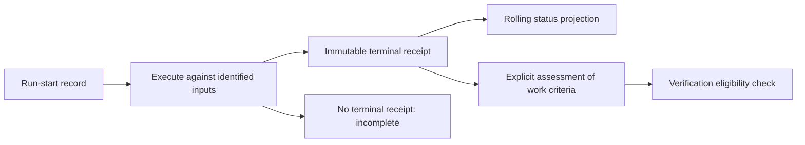

# Immutable verification receipts — design discussion

Status: first local implementation available through `verify --receipt [--work W]` and
`receipts [verification:sha256-ID] [--json]`. The remaining sections describe the design
and stronger future grades; they are not all implemented.

Implemented: raw-run observations (named TAP serial evidence or fully passed supported batch matches), Git-visible before/after input manifests, effective
configuration and local executor fingerprints, durable non-replacing publication,
incomplete starts, strict dependency/hash/shape checks, selected Git transport, and
work-definition binding. Orientation requires a current eligible receipt plus an explicit
assessment edge; legacy labels no longer clear completed work.

The terminal seal is `starts/<run-id>.done.json` and must travel with the start, receipt
and required artifacts. It atomically selects one terminal digest before result publication;
a missing result remains unavailable. No pruning/upload/commit command runs automatically.

Not implemented: authenticated executors, immutable execution snapshots, structured
criterion-to-observation assessment matrices, authorized invalidation/revocation records,
remote artifact storage, or source snapshot capture. Local receipt integrity is not
executor authenticity or a proof of criterion adequacy. The input boundary is explicitly
Git-visible files excluding status and UUID publication scratch, receipt files, verification jobs/narrative and the
work/consequence ledgers; selected work identity is captured separately. Ignored inputs,
services and runtime environment remain outside this grade.

A receipt would answer: **what did this executor actually check, against which bytes, and what happened?** An explicit assessment would separately answer: **why does that run verify this work?** Keeping those questions separate prevents an immutable but irrelevant passing test from clearing an obligation.

The existing subjects justify discussing this mechanism: at the start of the September 11 repair, orientation reported four completed work orders without verification links and two verification references it could not existence-check. The public CLI test in `test/swarm-cli.test.ts` deliberately lets an assessor-authored `verification:verify-focused` address clear the work obligation. Today that is an explicit link, not a resolvable run identity.

## Record this run, not the current dashboard

`src/evidence/status.ts` merges scoped reports and preserves an older pass when a later run skips that claim. That is useful for a last-known-status display. Hashing that merged file would create a misleading receipt: it could attribute an old pass to the new run.

The executor should instead publish an immutable terminal record from the current run's raw observations, before they merge into status. A rolling status projection may point to receipts; it must not manufacture them. Existing historical status remains historical status, with no automatic migration into witnessed runs.

| Receipt field | What it establishes |
| --- | --- |
| Schema version, unique run identity, start/end times | The event being described and its format; repeated identical checks remain distinct runs. |
| Executor identity, harness version/build, runner and report-parser identity | Which instrument produced and interpreted the result. Session/agent names are attribution, not authentication. |
| Invocation and configuration fingerprint | Which command, selectors, adapters and relevant settings governed the run. Secret values and raw environment dumps are excluded. |
| Repository and input manifest | Full commit identity where available, index/worktree input hashes, relevant untracked files, config, tests, specs and dependency lockfile. A short commit plus `dirty: true` is insufficient. |
| Declared scope and evidence grade | Which components, claims, files and named tests were selected; structural checks, executable checks and imported reports remain distinguishable. |
| Observed results | Selected, executed, passed, failed, skipped and unresolved tests/claims, with exact identities. Exit zero with no matched tests is not execution evidence. |
| Run completion and input stability | Completed, failed, cancelled, interrupted or unknown; whether the material inputs changed while the executor ran. |
| Artifact references and digests | Bounded report data and any retained stdout/stderr artifacts, with explicit availability. A digest does not make absent artifacts retrievable. |

Two fingerprint samples alone cannot prove the inputs stayed unchanged between them: bytes can change and change back. The strongest practical grade runs against an immutable snapshot with a pinned toolchain. A shared-worktree run can record before/after fingerprints and its weaker observation grade; detected changes make it ineligible for current verification, while matching samples do not claim snapshot isolation. Network services, mutable databases and nondeterminism remain declared environmental limits.

The input boundary should be declared and reviewable. Hashing only the edited file misses its tests and dependencies; hashing the entire mutable journal makes unrelated coordination activity invalidate every run. Include evidence actually used as an input, and disclose dependencies outside the captured boundary. Receipt/status outputs are excluded by their exact declared output paths, not by excluding all `.coherence` evidence.

## Proposed file storage

Use ordinary files under the repository's `.coherence` directory, keeping the existing
rolling `status.json` separate:

```text
.coherence/
  status.json                         # last-known dashboard; rewritten
  verification/
    starts/<run-id>.json               # immutable record that a run began
    starts/<run-id>.done.json          # single-assignment terminal digest
    receipts/<receipt-hash>.json       # immutable completed-run facts
    artifacts/<artifact-hash>         # input manifests, reports, optional logs
```

One receipt file describes one completed run. Its name is the hash of its canonical
contents; the hash is computed without a self-referential ID field. The receipt includes
the start-record digest and the digests of required artifacts. Work assessments use the
receipt's stable address, for example `verification:sha256-…`, so they cannot quietly
begin referring to a newer run. A second run writes a second receipt. Missing terminal
receipts leave their starts visibly incomplete.

The JSON should contain the useful summary directly: which code and scope were tested,
which required checks ran and passed, and who recorded the run. Larger input manifests
and runner reports are separate addressed artifacts. A manifest of hashes lets a reader
compare available files with the tested inputs, but cannot recover missing source bytes:
historical reconstruction additionally needs the Git objects or a retained source
snapshot/patch and its base. Receipt files need not contain a copy of the whole repository.

“Immutable” is the writer/reader contract, not a special filesystem feature. Writers
never replace an existing receipt. Readers recompute its hash and reject changed bytes
under the old address. A user can still edit files or fabricate a different receipt;
the executor trust policy below remains necessary.

For Git, keep exploratory run files local by default. When promoting a verification
assessment, prepare its receipt, start record and required artifacts together as the
small evidence set to review and commit. Unrelated runs and optional logs need not be
committed. The consumer must not call a committed reference verified when the referenced
evidence exists only on the original author's laptop. This also keeps a swarm's entire
run history out of Git unless deliberately selected.

The first implementation can resolve local files and committed Git content only; a
remote artifact service is optional future work. Pruning unreferenced local runs is a
separate retention operation. It must preserve every dependency of retained assessments,
or leave an explicit missing-evidence state. Hashes are addresses, not backups.

## Publication and interruption



A start record and terminal receipt are separate append-only facts. A killed executor leaves an incomplete run, never an inferred pass. If a later observer establishes interruption, it appends that observation instead of changing the start record. A receipt-required invocation must report failure to persist its receipt; the current status writer's best-effort behavior is unsuitable for a promised durable identity.

Use a versioned canonical representation and a content-addressed terminal identity, such as `verification:sha256-…`. Publish complete bytes atomically without overwriting an existing different object; validate framing, shape, digest and containment on read. Define a single valid terminal successor for each start record; conflicting successors refuse rather than selecting the latest. Durability across power loss requires an explicit file/directory synchronization contract appropriate to the supported filesystem, not just rename.

Corrections and invalidations append records referring to the original receipt. The policy must name who can invalidate an accepted receipt; an arbitrary writer's disagreement is an assessment, not revocation authority. A rerun produces a new identity. Strict readers expose missing, damaged, conflicting or invalidated evidence; deleting an artifact must not turn its reference into an innocuous empty population. Commit the small receipt/manifest records when portable evidence is wanted and test reconstruction in a fresh clone. Optional logs can remain separate with an explicit weaker availability grade; missing artifacts required to assess the result block eligibility.

## Linking a receipt to work

Retain the existing `verification --verifies--> work` relationship, but require its verification endpoint to resolve before calling it verified. The assessor still states why the run is relevant. Reuse the existing content-addressed `WorkOpened.id`, which already freezes the criteria, plus the output/input fingerprint being assessed. There is no need to add mutable criteria revisions. A stable work label alone must not endorse later outputs under the same label.

Current consequence evidence is prose. Enforcing criterion coverage would require a validated structured assessment naming criterion identities, receipt observations, output fingerprints and policy version. That is an explicit contract extension; the reader must not infer a coverage matrix from the existing free-text explanation.

A policy can then require all of the following:

1. The referenced receipt is complete, intact and not invalidated. Completion is separate from success: every required observation must pass; failed, skipped, unresolved or pending checks cannot satisfy it. An exit-zero adoption run or a run with pending jobs is insufficient.
2. It supplies the required evidence grade; fast structural presence or an imported historical report cannot masquerade as witnessed execution.
3. Its explicit coverage meets the named work criteria under an attributable assessment. Unmapped criteria remain outstanding.
4. Its tested inputs correspond to the outputs being assessed. A historical receipt remains true after code changes, but may cease to satisfy current verification.
5. Its executor meets the project's trust policy.

Avoid a lifecycle cycle: verification may run while work is active, then completion can cite the receipt for unchanged outputs. Bind to the work definition and output identity, not a future completion event that the run cannot already contain. Work completion and verification eligibility remain separate states unless the project deliberately adopts a stronger closure policy.

## Integrity is not trustworthy execution

Content addressing detects altered bytes under an existing address. Anyone who can write repository files can fabricate a different internally valid receipt and its hash. A local receipt therefore means “this executor recorded this run” at the declared local trust grade. It does not prove who executed it or that assertions establish semantic correctness.

If receipts are to authorize consequential CI actions, accept only records from a trusted executor boundary, optionally with signatures or CI attestation verified against explicitly configured trust roots. Signing an agent-authored claim without witnessing execution adds no such assurance. The policy must also distinguish trusted execution from the assessor's judgment that a test is adequate.

## Smallest useful rollout

Start by retaining current-run observations and an immutable input manifest, then teach consequence inspection to resolve receipt identities. Keep old free-form references visible as **legacy, unchecked**; never silently upgrade or erase them. Only after the reader and migration behavior are tested should a versioned regulation policy require receipts instead of links. Update both hosts' startup instructions, controls, documentation and tests when that public coordination contract changes.

The discriminating tests are concrete: a skipped run cannot inherit a pass into its receipt; an unmatched filter cannot supply executable evidence; a killed run cannot complete; concurrent writers cannot overwrite or forge terminal successors; tampering, missing objects and unavailable artifacts remain visible; an unrelated passing test cannot verify another work scope; source changes invalidate currency without rewriting historical facts; and a fresh clone reconstructs the same receipt and explicit assessment.

This proposal adds auditability and a stronger basis for policy. It does not establish that a test was sufficient, that an agent understood its result, or that the resulting implementation is correct.
